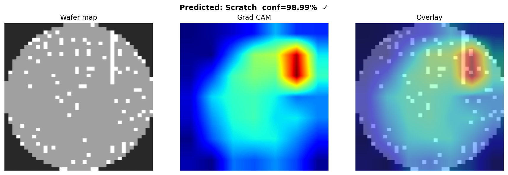
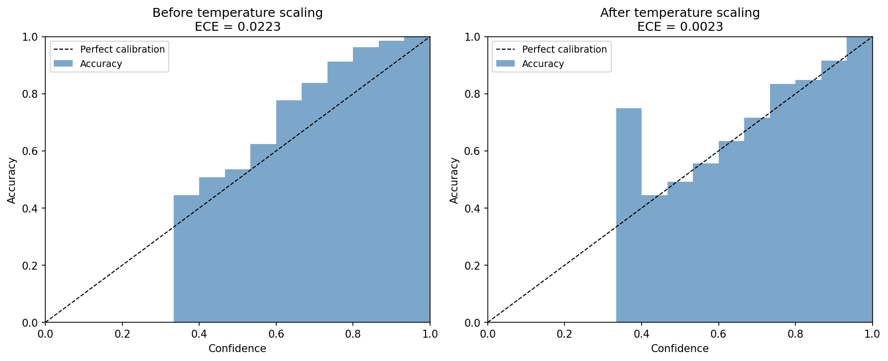

# wafer-ssl

Self-supervised and ensemble extensions for
[wafer-defect-classifier](https://github.com/alex8642/wafer-defect-classifier).

**Goal:** Push the WM-811K 9-class macro-F1 beyond the 0.9157 achieved with
focal loss + CBAM by using the 638k unlabeled production maps for self-supervised
contrastive pretraining (SimCLR), then ensembling independently fine-tuned models.

---

## Motivation

The base project's Phase S (pseudo-labeling) regressed from 0.9157 to 0.9085.
Root cause: hard pseudo-labels at 95% confidence carry ~5% label noise —
enough to silently degrade Scratch/Loc/Random recall on rare tail classes.

**Self-supervised contrastive learning eliminates label noise entirely.**
SimCLR learns representations by contrasting augmented views of the same map
without any labels. The 638k unlabeled maps are used as unlabeled structural
examples, not as labeling candidates.

---

## What's in this repo

| Module | Description |
|---|---|
| `src/wafer_ssl/pretrain.py` | SimCLR pretraining on 638k unlabeled WM-811K maps |
| `src/wafer_ssl/ensemble.py` | Multi-checkpoint ensemble evaluation |
| `configs/pretrain.yaml` | Pretraining hyperparameters |
| `PLAN.md` | Full plan, execution timeline, and honest ceiling analysis |

---

## Setup

```bash
# 1. Install the base package (wafer-defect-classifier must be on disk)
pip install -e /path/to/wafer-defect-classifier

# 2. Install this package
pip install -e .
```

Both packages must be installed in the same virtualenv.

---

## Usage

### Phase P — Pretrain backbone (~3–5 hours on RTX 5090)

```bash
python -m wafer_ssl.pretrain --config configs/pretrain.yaml
```

Edit `configs/pretrain.yaml` first to set `data_root` to your LSWMD.pkl location.

Saves `outputs/pretrained_backbone.pt` after each improvement in NT-Xent loss.
Prints loss every 10 epochs.

**Watch the loss curve — it's the diagnostic.** A first attempt with a mild crop
(`crop_min: 0.85`) produced a loss that started very low (~0.46) and stayed flat.
That is the *symptom of a trivially-solvable contrastive task*: the augmentations
preserved the global wafer outline, which is a near-unique per-map fingerprint, so
the backbone matched positive pairs by geometry instead of learning defect structure.
The fix is aggressive cropping + cutout (`crop_min: 0.2`, see `configs/pretrain.yaml`),
which forces the model to compare local defect texture. If the loss *still* starts
very low and barely moves, the task is still too easy — strengthen augmentation
before trusting the backbone.

### Phase Q — Fine-tune on pretrained backbone

```bash
# Copy backbone to the base repo's outputs directory
cp outputs/pretrained_backbone.pt /path/to/wafer-defect-classifier/outputs/

# In wafer-defect-classifier/configs/baseline.yaml, add/set:
#   backbone_ckpt_path: outputs/pretrained_backbone.pt
#   loss: focal
#   cbam: true
#   num_epochs: 40
#   patience: 10

cd /path/to/wafer-defect-classifier
.venv/bin/python -m wafer.train && \
.venv/bin/python -m wafer.calibrate && \
.venv/bin/python -m wafer.evaluate
```

### Phase R — Ensemble (3 additional seeds)

```bash
# In wafer-defect-classifier (same backbone_ckpt_path, different seeds):
# (seed 99 replaced an original seed-7 run that stalled during training — see git history)
.venv/bin/python -m wafer.train --seed 99  --output-dir outputs/seed99
.venv/bin/python -m wafer.train --seed 123 --output-dir outputs/seed123
.venv/bin/python -m wafer.train --seed 456 --output-dir outputs/seed456

# Evaluate ensemble from this repo:
python -m wafer_ssl.ensemble \
  --checkpoints \
    /path/to/wafer-defect-classifier/outputs/best.pt \
    /path/to/wafer-defect-classifier/outputs/seed99/best.pt \
    /path/to/wafer-defect-classifier/outputs/seed123/best.pt \
    /path/to/wafer-defect-classifier/outputs/seed456/best.pt \
  --config /path/to/wafer-defect-classifier/configs/baseline.yaml \
  --data-root /path/to/wafer-defect-classifier/data/raw
```

---

## Results

**A 4-model SimCLR ensemble reaches test macro-F1 0.9423** (balanced accuracy
0.9427), up from the 0.9157 single-model baseline. An ablation isolates how much of
that gain comes from the self-supervised pretraining versus plain ensembling.

| Configuration | Test macro-F1 | Balanced acc |
|---|---|---|
| Phase F baseline (single model, seed 42, from scratch) | 0.9157 | 0.9085 |
| From-scratch 4-seed ensemble (control) | 0.9339 | 0.9348 |
| **SimCLR + 4-seed ensemble (Phase P+Q+R)** | **0.9423** | **0.9427** |

**Decomposition of the +2.66pp:**

```text
0.9157   single-model baseline  (one noisy draw; per-seed singles ranged 0.906–0.951)
 +1.8pp  4-seed ensembling      → 0.9339   (stabilizes tail-class variance)
 +0.8pp  SimCLR pretraining     → 0.9423   (modest, consistent representation gain)
```

The honest reading: **self-supervised pretraining helped, but modestly.** At the
single-model level it was within noise of the baseline (slightly below on its
unluckiest seed); the larger lever was ensembling. Two independent signals show the
+0.8pp SSL effect is real rather than noise:

- **Paired per-seed** (identical config, only the backbone init differs) — the
  SimCLR model beat the from-scratch model on 3 of 4 seeds:

  | seed | from-scratch | SimCLR | Δ |
  |---|---|---|---|
  | 42  | 0.9157 | 0.9057 | −1.0 |
  | 99  | 0.9346 | 0.9392 | +0.5 |
  | 123 | 0.9387 | 0.9511 | +1.2 |
  | 456 | 0.9459 | 0.9512 | +0.5 |

- **Per-class** — the SimCLR ensemble is ≥ the from-scratch ensemble on all 9
  classes, strictly higher on 6 (Center, Edge-Loc, Loc, Near-full, Random, none).

Per-class F1, headline SimCLR ensemble vs the single-model baseline:

| Class | Phase F (single) | SimCLR ensemble |
|---|---|---|
| Edge-Ring | 0.99 | 0.99 |
| none | 0.99 | 1.00 |
| Center | 0.95 | 0.97 |
| Near-full | 0.95 | 0.98 |
| Random | 0.91 | 0.94 |
| Edge-Loc | 0.89 | 0.93 |
| Donut | 0.86 | 0.92 |
| Scratch | 0.86 | 0.88 |
| Loc | 0.84 | 0.88 |

We fell short of the 0.98 stretch target — expected, given tail-class data scarcity
(Donut: 111 test samples, Near-full: 30). The defensible result is **0.9423**, with a
clean ablation showing where it came from.

*Two minor confounds, stated for fairness: each ensemble applied its own seed-42
calibrated decision thresholds (a sub-tenth-pp post-processing difference), and the
SimCLR seeds used slightly more early-stopping patience on one seed. Neither changes
the conclusion.*

### Phase P — SimCLR pretraining loss


NT-Xent loss over 638k unlabeled maps (batch 256, cosine-decayed LR, 200 epochs).
The curve descends smoothly from **3.83 → 1.40** — the signature of a non-trivial
contrastive task. An earlier mild-crop attempt sat flat near 0.46 from epoch 1
because the augmentations preserved the global wafer outline (a near-unique per-map
fingerprint), letting the model match positive pairs by geometry instead of defect
structure. The aggressive-crop + cutout fix (`crop_min: 0.2`) broke that shortcut.

### Phase Q — diagnostics (SSL-fine-tuned model)

The fine-tuned model stays well-calibrated (ECE 0.0223 → 0.0023 after temperature
scaling, T=0.60) and localizes defects sensibly. Grad-CAM on a representative single
SimCLR model:

| Grad-CAM: Loc | Grad-CAM: Scratch |
|---|---|
|  |  |



---

## References

- Chen et al. (2020). *A Simple Framework for Contrastive Learning of Visual Representations.* ICML 2020. [arXiv:2002.05709](https://arxiv.org/abs/2002.05709)
- Woo et al. (2018). *CBAM: Convolutional Block Attention Module.* ECCV 2018.
- Lin et al. (2017). *Focal Loss for Dense Object Detection.* ICCV 2017.
- Wu et al. (2015). *Wafer Map Failure Pattern Recognition.* IEEE Trans. Semiconductor Manufacturing.
