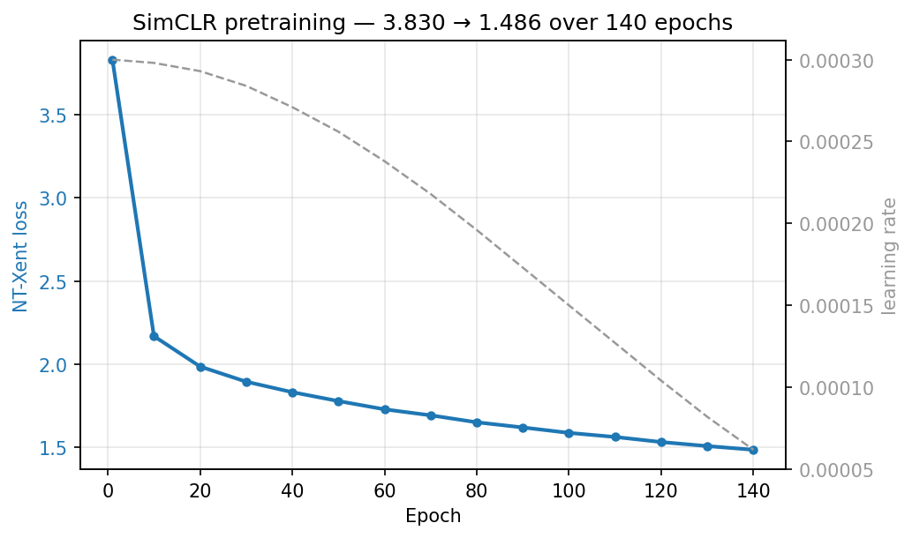
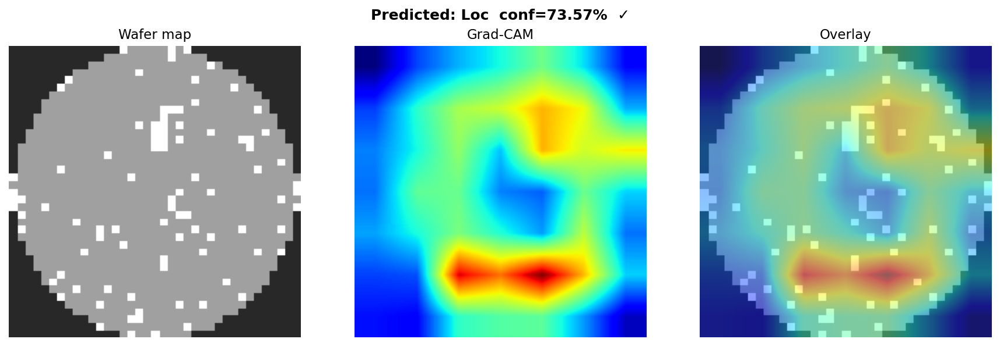

# wafer-ssl

Self-supervised and ensemble extensions for
[wafer-defect-classifier](https://github.com/alex8642/wafer-defect-classifier).

**Goal:** Push the WM-811K 9-class macro-F1 beyond the 0.9157 achieved with
focal loss + CBAM by using the 638k unlabeled production maps for self-supervised
contrastive pretraining (SimCLR), then ensembling independently fine-tuned models.

---

## Motivation

The base project's Phase S (pseudo-labeling) regressed from 0.9157 to 0.9085.
Root cause: hard pseudo-labels at 95% confidence carry ~5% label noise —
enough to silently degrade Scratch/Loc/Random recall on rare tail classes.

**Self-supervised contrastive learning eliminates label noise entirely.**
SimCLR learns representations by contrasting augmented views of the same map
without any labels. The 638k unlabeled maps are used as unlabeled structural
examples, not as labeling candidates.

---

## What's in this repo

| Module | Description |
|---|---|
| `src/wafer_ssl/pretrain.py` | SimCLR pretraining on 638k unlabeled WM-811K maps |
| `src/wafer_ssl/ensemble.py` | Multi-checkpoint ensemble evaluation |
| `configs/pretrain.yaml` | Pretraining hyperparameters |
| `PLAN.md` | Full plan, execution timeline, and honest ceiling analysis |

---

## Setup

```bash
# 1. Install the base package (wafer-defect-classifier must be on disk)
pip install -e /path/to/wafer-defect-classifier

# 2. Install this package
pip install -e .
```

Both packages must be installed in the same virtualenv.

---

## Usage

### Phase P — Pretrain backbone (~3–5 hours on RTX 5090)

```bash
python -m wafer_ssl.pretrain --config configs/pretrain.yaml
```

Edit `configs/pretrain.yaml` first to set `data_root` to your LSWMD.pkl location.

Saves `outputs/pretrained_backbone.pt` after each improvement in NT-Xent loss.
Prints loss every 10 epochs.

**Watch the loss curve — it's the diagnostic.** A first attempt with a mild crop
(`crop_min: 0.85`) produced a loss that started very low (~0.46) and stayed flat.
That is the *symptom of a trivially-solvable contrastive task*: the augmentations
preserved the global wafer outline, which is a near-unique per-map fingerprint, so
the backbone matched positive pairs by geometry instead of learning defect structure.
The fix is aggressive cropping + cutout (`crop_min: 0.2`, see `configs/pretrain.yaml`),
which forces the model to compare local defect texture. If the loss *still* starts
very low and barely moves, the task is still too easy — strengthen augmentation
before trusting the backbone.

### Phase Q — Fine-tune on pretrained backbone

```bash
# Copy backbone to the base repo's outputs directory
cp outputs/pretrained_backbone.pt /path/to/wafer-defect-classifier/outputs/

# In wafer-defect-classifier/configs/baseline.yaml, add/set:
#   backbone_ckpt_path: outputs/pretrained_backbone.pt
#   loss: focal
#   cbam: true
#   num_epochs: 40
#   patience: 10

cd /path/to/wafer-defect-classifier
.venv/bin/python -m wafer.train && \
.venv/bin/python -m wafer.calibrate && \
.venv/bin/python -m wafer.evaluate
```

### Phase R — Ensemble (3 additional seeds)

```bash
# In wafer-defect-classifier (same backbone_ckpt_path, different seeds):
.venv/bin/python -m wafer.train --seed 7   --output-dir outputs/seed7
.venv/bin/python -m wafer.train --seed 123 --output-dir outputs/seed123
.venv/bin/python -m wafer.train --seed 456 --output-dir outputs/seed456

# Evaluate ensemble from this repo:
python -m wafer_ssl.ensemble \
  --checkpoints \
    /path/to/wafer-defect-classifier/outputs/best.pt \
    /path/to/wafer-defect-classifier/outputs/seed7/best.pt \
    /path/to/wafer-defect-classifier/outputs/seed123/best.pt \
    /path/to/wafer-defect-classifier/outputs/seed456/best.pt \
  --config /path/to/wafer-defect-classifier/configs/baseline.yaml \
  --data-root /path/to/wafer-defect-classifier/data/raw
```

---

## Results (to be updated)

| Experiment | Val macro-F1 | Test macro-F1 |
|---|---|---|
| Phase F baseline (focal+CBAM) | 0.9265 | **0.9157** |
| Phase P+Q (SimCLR + fine-tune) | — | — |
| Phase R (4-model ensemble) | — | — |

### Phase P — SimCLR pretraining loss



NT-Xent loss over 638k unlabeled maps, batch 256, cosine-decayed LR. The curve
descends smoothly from **3.83 → ~1.49** — the signature of a non-trivial
contrastive task. The earlier mild-crop attempt sat flat near 0.46 from epoch 1
because the augmentations preserved the global wafer outline (a per-map
fingerprint), letting the model match positives by geometry instead of defect
structure. The aggressive-crop + cutout fix (`crop_min: 0.2`) broke that shortcut.

*Regenerate from the full run before publishing:*
```bash
python -m wafer_ssl.pretrain --config configs/pretrain.yaml | tee outputs/pretrain.log
python scripts/plot_pretrain_loss.py --log outputs/pretrain.log
```

### Phase Q diagnostics (added after fine-tuning on the 5090)

`scripts/run_phases_qr.sh` regenerates these for the SSL-fine-tuned model in the
base repo's `outputs/`. After the run, copy the ones you want to show here:
```bash
cp ../wafer-defect-classifier/outputs/confusion_matrix.png      assets/q_confusion_matrix.png
cp ../wafer-defect-classifier/outputs/grad_cam/gradcam_loc.png  assets/q_gradcam_loc.png
```
Then reference them below (placeholders until the run completes):

<!--  -->
<!--  -->

---

## References

- Chen et al. (2020). *A Simple Framework for Contrastive Learning of Visual Representations.* ICML 2020. [arXiv:2002.05709](https://arxiv.org/abs/2002.05709)
- Woo et al. (2018). *CBAM: Convolutional Block Attention Module.* ECCV 2018.
- Lin et al. (2017). *Focal Loss for Dense Object Detection.* ICCV 2017.
- Wu et al. (2015). *Wafer Map Failure Pattern Recognition.* IEEE Trans. Semiconductor Manufacturing.
